 

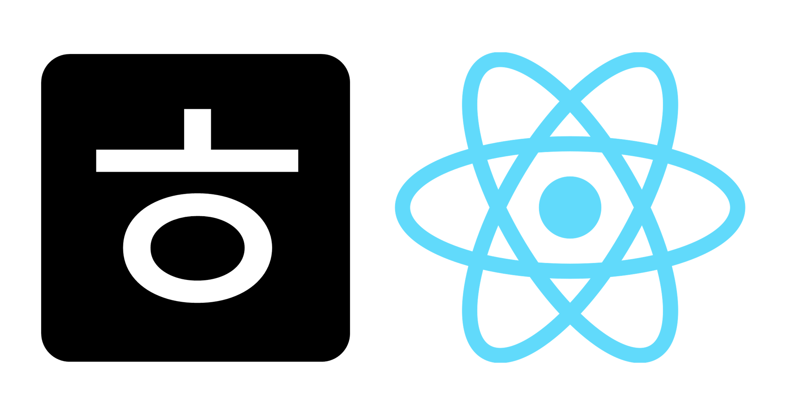

 
<!-- Index -->

**Index**

<ul>
    <li><a href="#overview">Overview</a></li>
    <li><a href="#introduction">Introduction</a></li>
    <li><a href="#configuration">Configuration</a></li>
    <li><a href="#roadmap">Roadmap</a></li>
    <li><a href="#stacks">Stacks</a></li>
   <li><a href="#browser-support">Browser Support</a></li>
   <li><a href="#members">Members</a></li>
</ul>

---

# Overview

- **프로젝트명**: 호사로운(React 리팩토링)

- **기간**: 2023.02.21. ~ 2023.02.24.

- **목표**: 기존 호사로운(JS) 페이지를 React로 리팩토링 하였습니다.

- **배포주소**: http://hosaroun.dothome.co.kr/

- **기존 페이지 Repository를 보고싶다면 [여기를](https://github.com/coldair426/hosaroun) 참고하세요.**

# Introduction

기존 춘천 호사로운 팬션의 정보를 제공하는 웹 서비스를 React로 리팩토링 하였습니다.

**주요 기능**:

- **사진**: 캐로셀 슬라이더를 이용해 다양한 사진을 효과적으로 제공합니다.

- **카카오맵 API**: 카카오맵 API를 이용해 위치를 정확하게 표현하고, 지도보기와 길찾기 링크를 제공합니다.

# Configuration

## pc

| 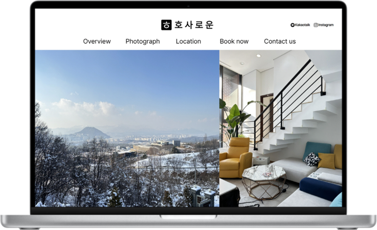 | 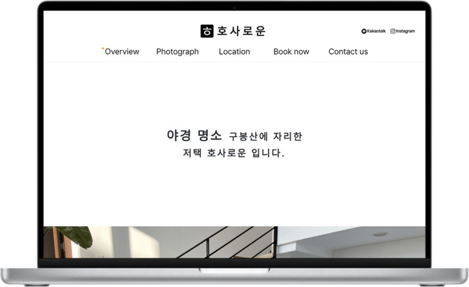 | 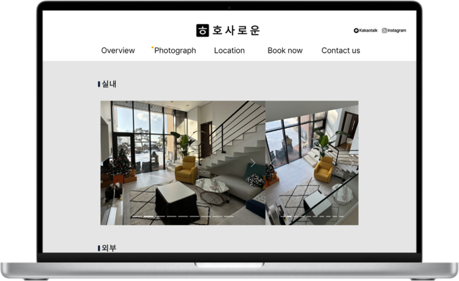 |
| :---------------------------------------------: | :------------------------------------------------: | :---------------------------------------------: |
|                     Home.js                     |                    Overview.js                     |                  Photograph.js                  |

| 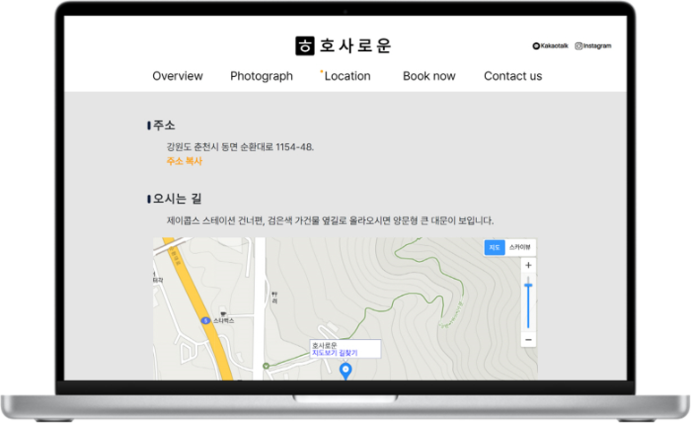 | 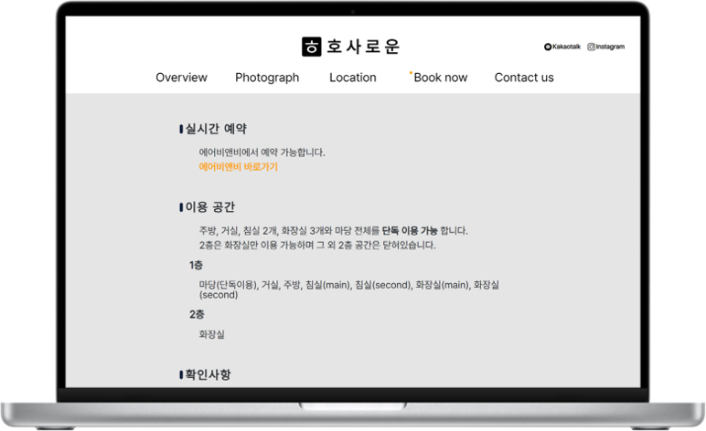 | 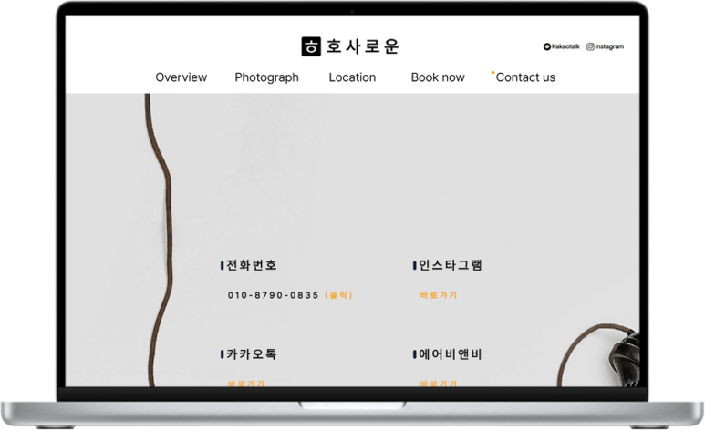 |
| :------------------------------------------------: | :-----------------------------------------------: | :-------------------------------------------------: |
|                    Location.js                     |                    Booknow.js                     |                    Contactus.js                     |

## Mobile

| 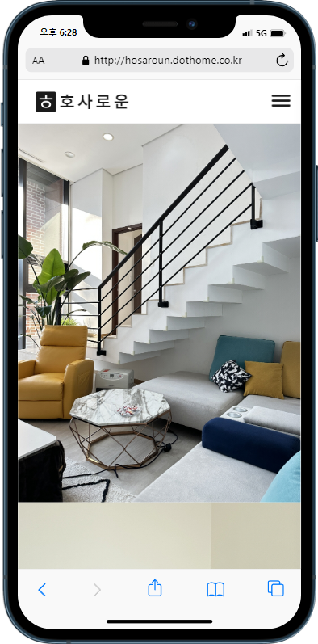 | 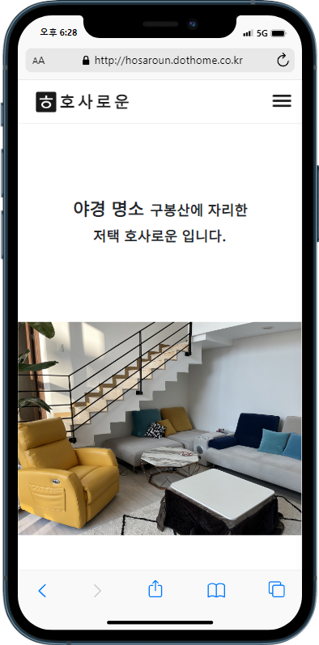 | 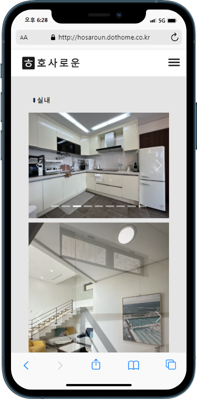 |
| :---------------------------------------------------: | :------------------------------------------------------: | :---------------------------------------------------: |
|                        Home.js                        |                       Overview.js                        |                     Photograph.js                     |

| 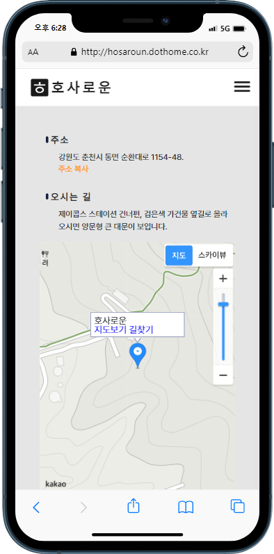 | 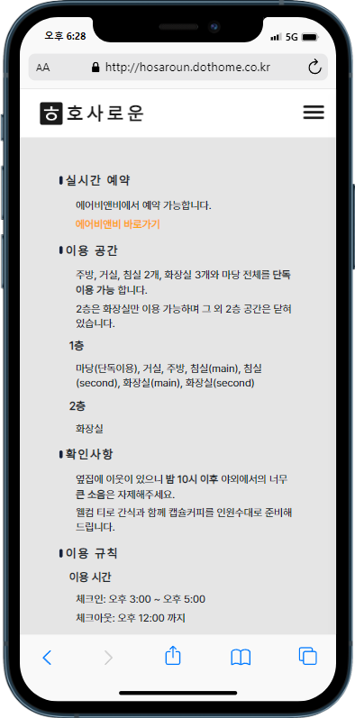 | 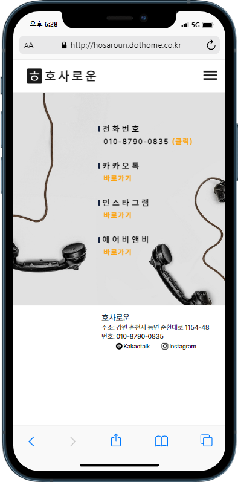 |
| :------------------------------------------------------: | :-----------------------------------------------------: | :-------------------------------------------------------: |
|                       Location.js                        |                       Booknow.js                        |                       Contactus.js                        |

# Roadmap

- [x] REACT 리펙토링
- [x] Copy alert(React Bootstrap)
- [x] Carousel slider(React Bootstrap)
- [x] Location map(Kakao map api)
- [x] 현재 페이지 표시(React Router-dom)
- [x] Responsive Web(CSS)
- [x] Mobile sticky header(CSS)
- [x] Mobile navigation box(React)
- [x] PC navigation bar(React)
- [x] CSS reset(styled-reset)
- [x] Router(React Router-dom)
- [ ] 관리자 페이지
- [ ] CRUD 게시판

# Stacks

- **Environment**:   

- **Developement**:
  - **FRONT-END**:   

# Browser Support

  

# Members

- **HONG(FRONT-END)**

  - **GitHub**: https://github.com/coldair426
  - **Blog**: https://velog.io/@coldair426
  - **Mail**: coldair426@gmail.com

---

**Full README가 보고 싶다면 [velog](https://velog.io/@coldair426/series/%ED%98%B8%EC%82%AC%EB%A1%9C%EC%9A%B4%ED%94%84%EB%A1%9C%EC%A0%9D%ED%8A%B8)를 참고하세요.**
