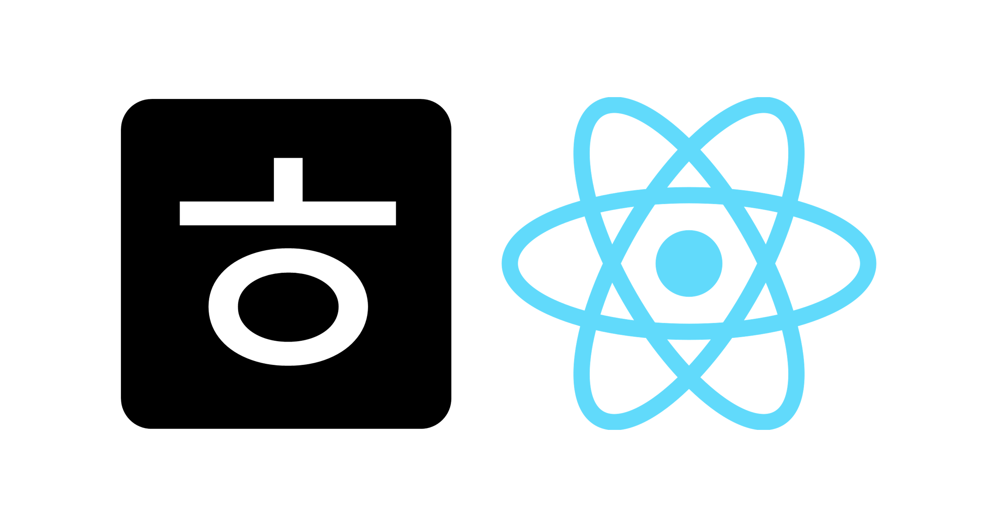

<!-- 목차 -->

**목차**

<ul>
    <li><a href="#개요">개요</a></li>
    <li><a href="#페이지-구성">페이지 구성</a></li>
    <li><a href="#기능">기능</a></li>
    <li><a href="#배포주소">배포주소</a></li>
    <li><a href="#browser-support">Browser Support</a></li>
    <li><a href="#stacks">Stacks</a></li>
    <li><a href="#members">Members</a></li>
</ul>

---

# 개요

- 프로젝트명 : 호사로운-React
- 기간 : 2023.02.21. ~ 2023.02.24.
- 목표 : 기존 HTML, CSS, Vanilla JS로 제작한 호사로운 페이지를 React로 리팩토링
- **기존 페이지 Repository를 보고싶다면 [여기를](https://github.com/coldair426/hosaroun) 참고하세요.**

# 페이지 구성

## pc

|  |  |  |
| :---------------------------------------------: | :------------------------------------------------: | :---------------------------------------------: |
|                     Home.js                     |                    Overview.js                     |                  Photograph.js                  |

|  |  |  |
| :------------------------------------------------: | :-----------------------------------------------: | :-------------------------------------------------: |
|                    Location.js                     |                    Booknow.js                     |                    Contactus.js                     |

## Mobile

|  |  |  |
| :---------------------------------------------------: | :------------------------------------------------------: | :---------------------------------------------------: |
|                        Home.js                        |                       Overview.js                        |                     Photograph.js                     |

|  |  |  |
| :------------------------------------------------------: | :-----------------------------------------------------: | :-------------------------------------------------------: |
|                       Location.js                        |                       Booknow.js                        |                       Contactus.js                        |

# 기능

- Responsive Web(CSS)
- Mobile sticky header(CSS)
- Mobile navigation box(React)
- PC navigation bar(React)
- CSS reset(styled-reset)
- Location map(Kakao map api)
- Router(React Router-dom)
- 현재 페이지 표시(React Router-dom)
- Copy alert(React Bootstrap)
- Carousel slider(React Bootstrap)

## 앞으로 구현하고자 하는 것은

- 관리자 페이지
- CRUD 게시판

# 배포주소

- http://hosaroun.dothome.co.kr/

# Browser Support

- 
- 
- 

# Stacks

## Environment

- 
- 
- 

## Developement

- 

# Members

## 홍

- https://github.com/coldair426
- https://velog.io/@coldair426
- coldair426@gmail.com

---

**Full README가 보고 싶다면 [velog](https://velog.io/@coldair426/series/%ED%98%B8%EC%82%AC%EB%A1%9C%EC%9A%B4%ED%94%84%EB%A1%9C%EC%A0%9D%ED%8A%B8)를 참고하세요.**
